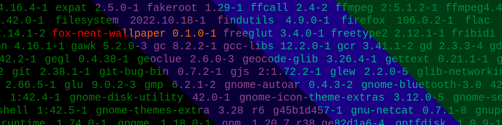

# Fox neat wallpaper



[](https://aur.archlinux.org/packages/fox-neat-wallpaper)

This is a simple script that generates a wallpaper based on installed packages and marks which ones are outdated.
This script is made to be used for archlinux with the xfce4 desktop environment, one might use it with other desktop environment menually.

## Installation

Can be installed from the [AUR](https://aur.archlinux.org/packages/fox-neat-wallpaper).

If you wish to install menually you should first make sure you have all dependencies:

```bash
# 1. clone the repository
git clone https://github.com/jNullj/fox-neat-wallpaper
cd fox-neat-wallpaper
# copy files to /opt/fox-neat-wallpaper
cp *.sh /opt/fox-neat-wallpaper
cp *.svg /opt/fox-neat-wallpaper
# copy pacman hook, systemd timer and service
cp fox-neat-wallpaper.hook /etc/pacman.d/hooks/fox-neat-wallpaper.hook
cp fox-neat-wallpaper.service /usr/lib/systemd/user/fox-neat-wallpaper.service
cp fox-neat-wallpaper.timer /usr/lib/systemd/user/fox-neat-wallpaper.service
# create a link of the exectuable to /usr/bin
ln -rTsF /opt/fox-neat-wallpaper/fox-neat-wallpaper.sh /usr/bin/fox-neat-wallpaper
```

## Usage

With a user you want to enable the wallpaper simply type
```bash
# Enable the wallpaper and create one
fox-neat-wallpaper all
```

To enable automatic updating of the wallpaper based of outdated packages also enable the systembd timer using:
```bash
# Enable timer for automatic updates
fox-neat-wallpaper enable-timer
```

If you use a desktop environment other then xfce4 you should menually set the wallpaper image. The script saves the wallpaper at `~/.fox-neat-wallpaper`
If you use other desktop environment and wish to automate this, pull requests are welcomed.

If you wish to replace the logo you could use your own by replacing the filename in the script.

## Contributing

Pull requests are welcome. For major changes, please open an issue first to discuss what you would like to change.

## License

The Arch Linux name and [logo](logo.svg) are recognized trademarks. Some rights reserved.
This project is created by the community and not an official project made or endorsed by Arch Linux.

For everything else: [MIT](LICENSE)

## Notice

The Arch Linux name and [logo](logo.svg) are recognized trademarks. Some rights reserved.
This project is created by the community and not an official project made or endorsed by Arch Linux.
